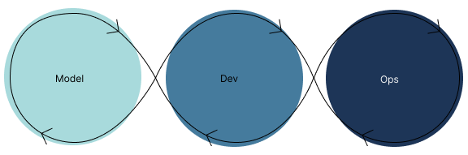
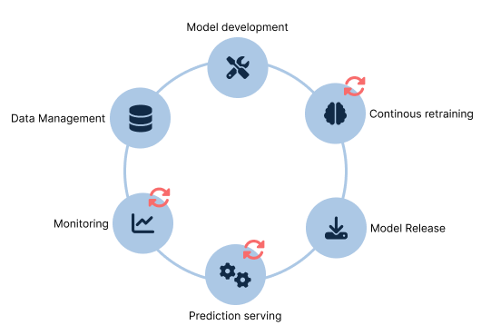
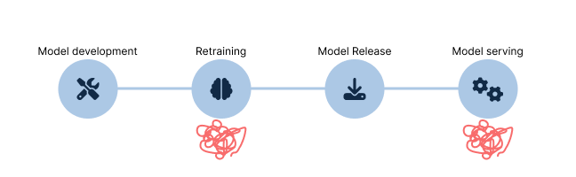

## Definition

MLOps stands for *Machine Learning Operations*. According this [Google Cloud Architecture Center Document](https://cloud.google.com/architecture/mlops-continuous-delivery-and-automation-pipelines-in-machine-learning):
> MLOps is an ML engineering culture and practice that aims at unifying ML system development (Dev) and ML system operation (Ops).

During a machine learning project, data scientists do the following:
- Retrieve and prepare data
- Train, evaluate and validate model(s)
- Use the model for prediction

Then, when it is time to update the model. The above three steps are applied again, most of the time *manually*. When the model has an issue in production, there are no mechanism to be aware of it or to even know why. That is where MLOps come in to play. It is a set of practices to ensure ML model are built, deployed in production and monitored, using automation tools at every step of the way, while respecting engineering best practices.

{image-display}

## Principles

### Why do you need MLOps process?
- Improve delivery time and efficiency
- Reduce failure and improve reliability
- Reduce time to market
- Focus on bringing value

### Section Name

{image-display}

### Minimal Must-Haves

{image-display}
Models have zero ROI if they can't be used. That is time to market is one of the metrics that most team try to optimise.

### Level of maturity

### Where to begin?
#### Strategy
- Set goals
- Define proccess
- Create a process control mecanism 
- Implement
- Define metrics to measure your strategy

### Toolings

### Skills of MLOps engineer
- Software engineering
  - Programming
  - Containerization (Docker and Kubernetes)
- Ops
  - CI/CD
  - Infrastructure as Code
  - Monitoring and observability Tool
- ML specific
  - ML basics
  - Model training, serving and validation
  - Orchestration Tool
- Database
  - SQL

## Sources
- [MLOps maturity assessment](https://marvelousmlops.substack.com/p/mlops-maturity-assessment)
- [The Minimum Set of Must-Haves for MLOps](https://marvelousmlops.substack.com/p/the-minimum-set-of-must-haves-for?utm_source=profile&utm_medium=reader2)
- https://research.aimultiple.com/mlops-benefits/