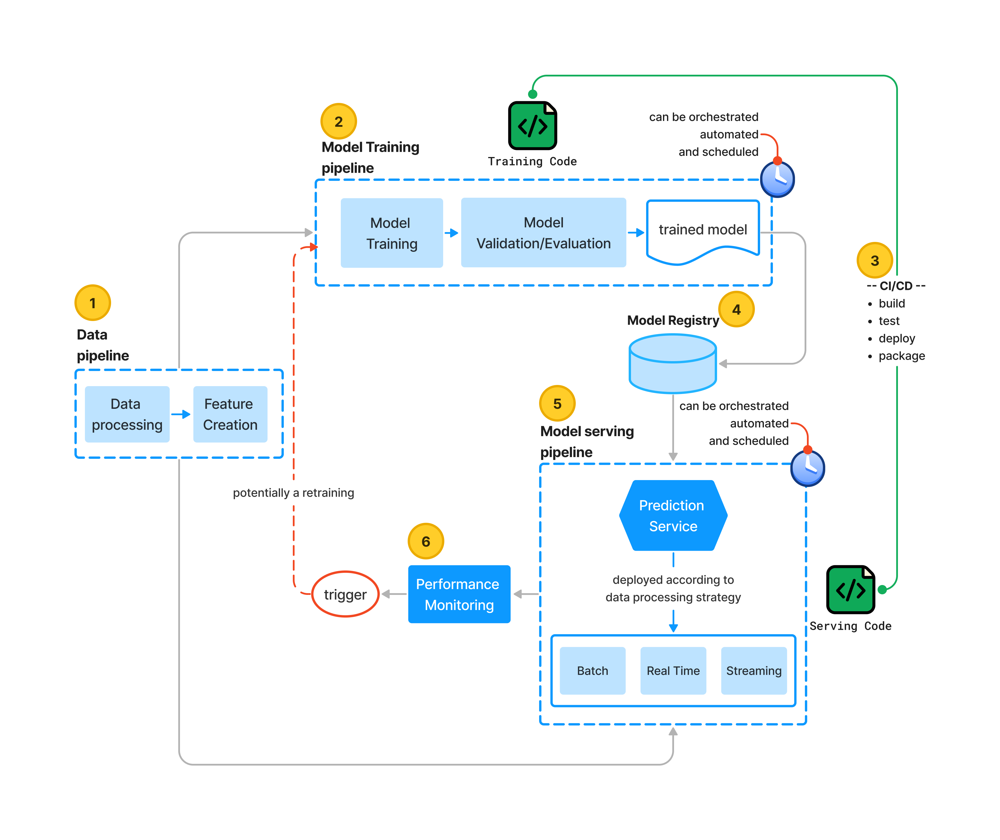

I wanted a toy project to show the different steps a machine learning (ML) project goes through "in real life". So I created the [tag generator project](https://github.com/tekeinhor/tag-generator). My focus was not on the modeling side but rather on the engineering and ops aspects of ML projects.
Before we dive into the various steps I took to complete this project, I would first like to discuss the architecture a ML project following [MLOps](/posts/mlops) principles.

## MLOps-based architecture for ML projects
{image-display}

The image above is what I think a complete ML pipeline (should) look like when fundamental principles of software engineerning and devops are applied. A productive, maintainable, reliable and efficient project requires the various components shown in the diagram. 
The components are:
1) A **data pipeline**: Data cleaning and processing are the first steps, followed by "Feature Creation". (Some people may add a Feature Store here). I separated this block from the Training pipeline one to emphasize that 'Feature Creation' is also a necessary step when serving the model.

2) A **(re)training pipeline**: This is where the magic happens, they say. This is where the model is created and engineered.
 
3) A **CICD**: Because eveything we are discussing is actual code,  it is important to follow the basic rules of code integration, testing and deployment.

4) A **model registry**: This is where we store and version the model and its metadata. The storage solution can range from a basic AWS S3 bucket to a more advanced option like the one offered by [MLFlow](https://mlflow.org/docs/latest/model-registry.html). 

5) A **model serving pipeline**: It is important to consider how the model will be used, and develop the service accordingly. The prediction service will be designed in *batch*, *real-time* or *streaming* mode depending on the size of the data(on which the predictions will be performed), latency tolerance of the result, and the availability of computation resources. 

6) A **performance monitoring setup**: This is where we collect metrics to assess the performance of the model and the prediction service global health. Alerts can be created and retraining can be triggered automatically based on said alerts.

It is important to note that it is still possible to achieve a working project without having all of these components in place.
The level of automation of the various components determines the maturity level of the project. For additional information on maturity level, please refer to [this article](https://cloud.google.com/architecture/mlops-continuous-delivery-and-automation-pipelines-in-machine-learning) from Google Cloud Architecture Center.

For the Tag generator project, I concentrated on blocks **3** and **5**.  I hope to include **1**, **2** and **6** in the future.

## The Tag generator project
The Tag generator project is a Natural Language Processing (NLP) ML project. The goal is to automatically assign tags to StackOverflow questions. I used the [Stack Exchange Data Dump](https://archive.org/details/stackexchange) which is an anonymized dump of all user-contributed content on the Stack Exchange Network, of which StackOverflow is a part.

Below, I describe the steps I took to create the project. I assigned each step to its usual role in an organisation.
Some of these steps will become fully-fledged articles where I will detail my choices, share my perspectives, or write tutorials.

### The "Data Scientist" job
1) Find an open dataset 
2) Define a problem to solve
3) Experiments with the dataset
4) Create the model
5) Serve the model through an API (real time data processing strategy)*
6) Code the API and Dockerize it*
7) Code the UI (user interface) and Dockerize it*

> **\*** Could be done by a data scientist or an MLOps engineer, depending on the data scientist's software engineering skills.

### A **DevOps team member** job
1) Choose to use a **monorepo** approach to code storage
2) Setup a linting, formating and testing tool
3) Implement **CICD** for linting, building, testing and deploying your python code: using in our case **Github Actions**
4) Use a **semantic release** tool to automatically release your code and tag your docker accordingly. Add the process to your **CICD** pipeline.

### The **"MLOPs Engineer"** job
1) Choose a deployment infrastructure: in our case **AWS**
2) Setup your AWS account
3) Choose your Infrastucure as Code (IaC) tool and organise your code accordingly: in our case **Terraform**
4) [Implement a **CICD** pipeline for deploying your resource](/posts/openid_connect) creation process on AWS using Terraform
4) Create your users and give them rights with Terraform
5) Create an S3 bucket and use it as a "basic" model registry
6) Package your applications (model serving API and UI) with Docker and push them to an image registry (ECR)
7) Choose a [deployment architecture for the your applications](/posts/archi) (**Docker, ECR, ECS Fargate**)

## What's next?
What I would want to do next?
1) An automatic retraining job
2) A Performance monitoring of the model
3) A cost monitoring of the AWS infrastructure
 