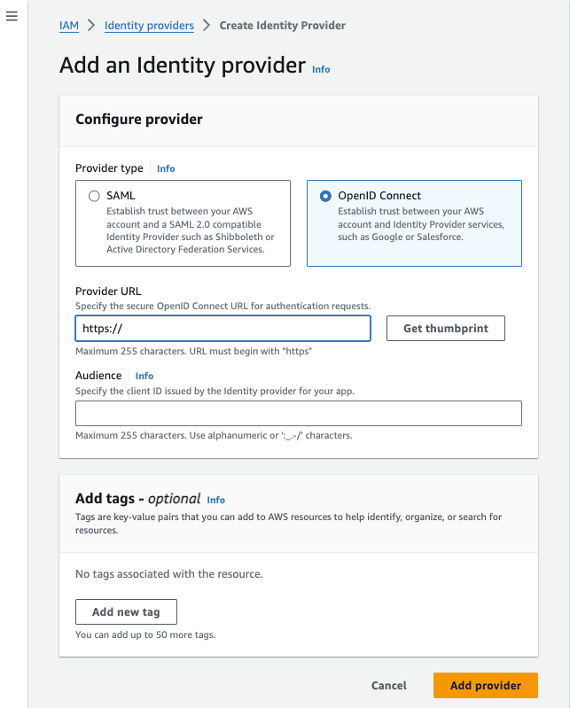
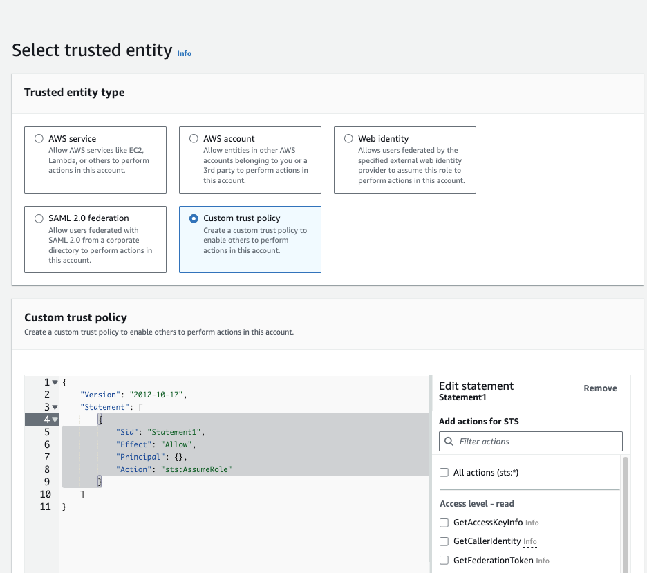

## Introduction

Terraform is an Infrastucture as Code (Ia)C software tool that provides a consistent command line interface (CLI) workflow to manage hundreds of cloud services, in our case AWS.
[Github Actions](https://docs.github.com/en/actions/learn-github-actions/understanding-github-actions) is a Continous Integration/Continious Deployment platform that allows you to automate your build, test, and deployment pipeline.

How can you use Github Actions to create/update/delete your AWS resources using Terrafor? The answer is OpenID Connect.
OpenID Connect (OIDC) allows your GitHub Actions workflows to access resources in your cloud provider, without having to store any credentials as long-lived GitHub secrets.

So need to create AWS `Access Key ID` and `Secret Access Key`  and store them in GitHub secrets.

## Config on Github

## Config on AWS

1) step 1: [create an IP](https://docs.aws.amazon.com/IAM/latest/UserGuide/id_roles_providers_create_oidc.html)
	- go to `IAM > Identity Providers`
	- create IP
	- you will need:
		- Provider URL:  https://token.actions.githubusercontent.com
		- Audience: sts.amazonaws.com
  - Add tags (optional)

{image-display}


2) : create the role that github actions will assume


- go to `IAM > Roles > Create Role`
-  selected trusted entity
{image-display}
And in the **Custom trust policy** section copy paste the following json
```json
{
  "Version": "2012-10-17",
  "Statement": [
    {
      "Sid": "Statement1",
      "Effect": "Allow",
      "Principal": {
        "Federated": "arn:aws:iam::<accountId>:oidc-provider/token.actions.githubusercontent.com"
      },
      "Action": "sts:AssumeRoleWithWebIdentity",
      "Condition": {
        "StringEquals": {
          "token.actions.githubusercontent.com:aud": "sts.amazonaws.com"
        },
        "StringLike": {
          "token.actions.githubusercontent.com:sub": "repo:<userName>/<repoName>:*"
        }
      }
    }
  ]
}
```

2) Add permissions (managed one)
3) Choose your role name, description and add tags


- add policy


step 3: write your workflow and the role created on step 2
## Write the code