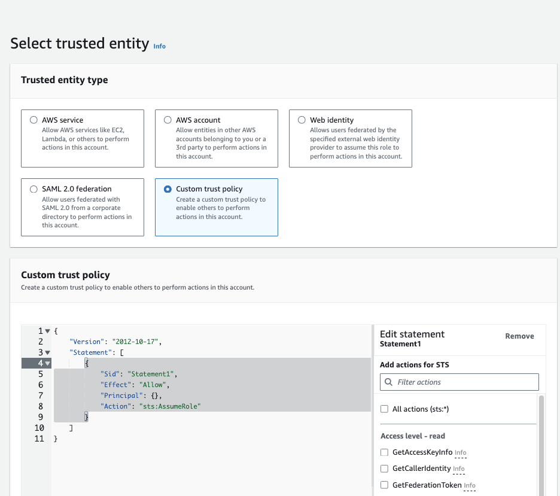

## Introduction

Terraform is an Infrastucture as Code (Ia)C software tool that provides a consistent command line interface (CLI) workflow to manage hundreds of cloud services, in our case AWS.
[Github Actions](https://docs.github.com/en/actions/learn-github-actions/understanding-github-actions) is a Continous Integration/Continious Deployment platform that allows you to automate your build, test, and deployment pipeline.

How can you use Github Actions to create/update/delete your AWS resources using Terraform The answer is OpenID Connect.
OpenID Connect (OIDC) allows your GitHub Actions workflows to access resources in your cloud provider, without having to store any credentials as long-lived GitHub secrets.

So need to create AWS `Access Key ID` and `Secret Access Key`  and store them in GitHub secrets.

## Config on AWS

1) [create an IP](https://docs.aws.amazon.com/IAM/latest/UserGuide/id_roles_providers_create_oidc.html)
    - go to `IAM > Identity Providers > Add Provider`
    - To add an Identity Provider, you will need the info below found on the Github [Configuring OpenID Connect in Amazon Web Services](https://docs.github.com/en/actions/deployment/security-hardening-your-deployments/configuring-openid-connect-in-amazon-web-services.) doc:
      - Provider URL: `https://token.actions.githubusercontent.com`
      - Audience: `sts.amazonaws.com`
    - Add tags (optional)
  


2) create the role that github actions will assume
    - go to `IAM > Roles > Create Role`
    - selected trusted entity. And in the **Custom trust policy** section copy paste the following json
    ```json
    {
      "Version": "2012-10-17",
      "Statement": [
        {
          "Sid": "Statement1",
          "Effect": "Allow",
          "Principal": {
            "Federated": "arn:aws:iam::<accountId>:oidc-provider/token.actions.githubusercontent.com"
          },
          "Action": "sts:AssumeRoleWithWebIdentity",
          "Condition": {
            "StringEquals": {
              "token.actions.githubusercontent.com:aud": "sts.amazonaws.com"
            },
            "StringLike": {
              "token.actions.githubusercontent.com:sub": "repo:<userName>/<repoName>:*"
            }
          }
        }
      ]
    }
    ```
    - Add permissions (managed one or customed)
    - Choose your role name, description and add tags
    {image-display}


## Write the code


### The terraform code

Let's say we want to create an s3 bucket

```tf
resource "aws_s3_bucket" "example" {
  bucket        = var.bucket_name
  force_destroy = false
}

resource "aws_s3_bucket_ownership_controls" "example" {
  bucket = aws_s3_bucket.example.id
  rule {
    object_ownership = "BucketOwnerPreferred"
  }
}

resource "aws_s3_bucket_acl" "example" {
  depends_on = [aws_s3_bucket_ownership_controls.example]

  bucket = aws_s3_bucket.example.id
  acl    = "private"
}
resource "aws_s3_bucket_public_access_block" "example" {
  bucket                  = var.bucket_name
  block_public_acls       = true
  block_public_policy     = true
  restrict_public_buckets = true
  ignore_public_acls      = true
}
```


### The github actions

Let's create our github actions for deploying the terraform code


To have a step by step tuto on how I create this github action, please visit this page 
[Implement a CICD for terraform with github action](/posts/githubactions_terraform).

To know the content of the `deploy-template.yaml` file please read [my post on how to create a CICD](/posts/githubactions_terraform)
```yaml
name: deploy
on:
  workflow_dispatch:
  pull_request:
    types: [opened, synchronize, closed]
    branches:
      - main
    paths:
      - "iac/terraform/**"

permissions:
  id-token: write # This is required for aws oidc connection
  contents: read # This is required for actions/checkout
  pull-requests: write # This is required for gh bot to comment PR

jobs:
  deploy-dev:
    uses: ./.github/workflows/deploy-template.yaml
    with:
      deploy-dir: "./iac/terraform/dev"
      terraform-version: "1.7.0"
    secrets:
      AWS_REGION: ${{ secrets.AWS_REGION }}
      AWS_ROLE_ARN: ${{ secrets.AWS_ROLE_ARN }}
```
