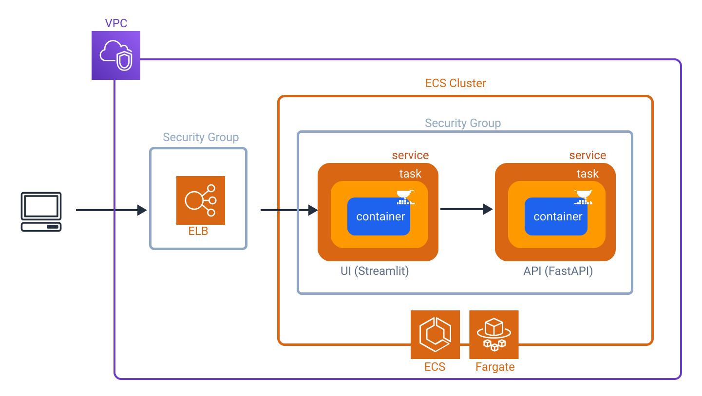

[Amazon ECS](https://docs.aws.amazon.com/AmazonECS/latest/developerguide/Welcome.html) (Amazon Elastic Container Service) is a fully managed container orchestration service that helps you easily deploy, manage, and scale containerized applications. There are three options for running containers with Amazon ECS:
- EC2: Deploy and manage your own cluster and manage yourself the EC2 instances on which everything is running)
- Fargate: No server to think about
- On-premises Virtual Machines (VM) or servers: you can register your own external on-premises server or Virtual Machine (VM), to your Amazon ECS cluster.

Are there any alternative to ECS? With AWS, the answer is likely to be YES! Let see our options:
- Elastic Beanstalk: you upload the code you want to run, configure a few deployment settings, and let Amazon complete the process for getting the app running for you.
- API Gateway + (Lambdas) : You can directly upload your code or use a container image. The lambda function execution time is limited to 15 minutes.
- EKS: highest barrier to entry

Containerization, pricing etc

{image-display}
In this tutorial, we will use ECS Fargate to deploy two apps: an **API** that serve our ML model predictions and a **UI** that will allow us to perform predictions


### Prerequisites
- Code your API (in our case it was created using python FastAPI)
- Create your API Dockerfile
- Code your UI (in our case it was created using python Streamlit)
- Create your UI Dockerfile
- Build your docker images and push them to ECR

If you want to follow the tutorial to create the UI and its dockerfile, please head to the following articles: [Create a UI with streamlit and dockerize it](#) and [Create a API in python with FastAPI and dockerize it](#). I also suggest this article about [How to build your docker image push it to an image repository like ECR](#).

## ECR Resources creation with Terraform
{image-display}

### Checklist of the elements we need to consider
Create a [Virtual Private Cloud](https://docs.aws.amazon.com/vpc/latest/userguide/what-is-amazon-vpc.html) (Amazon VPC)

- [x] Create your cluster
- [x] Create two ECS services (one for the UI, one for the API)
    - [x] For each service, create a task definition and roles needed to function correctly
- [x] Create a [Load Balancer](https://docs.aws.amazon.com/elasticloadbalancing/latest/userguide/what-is-load-balancing.html) to route the traffic to your services
- [x] Create two [Security Groups](https://docs.aws.amazon.com/vpc/latest/userguide/vpc-security-groups.html)
    - [x] One for the cluster
    - [x] One for the Load Balancer
- [x] Use [Service Connect](https://docs.aws.amazon.com/AmazonECS/latest/developerguide/service-connect.html) to allow a service-to-service communication (for the UI to interact with the API)


### Create a VPC or use an existing one

#### Use an existing one
```tf
data "aws_vpc" "default" {
  id = var.vpc_id
}
```
### Create your cluster
```tf
resource "aws_ecs_cluster" "ecs_cluster" {
  name = var.cluster_name
}
```

### Create the service for the API

Create the task definition

```tf
resource "aws_ecs_task_definition" "api_task" {
  family                   = var.api.task_name
  network_mode             = "awsvpc"
  cpu                      = "256"
  memory                   = "512"
  requires_compatibilities = ["FARGATE"]
  execution_role_arn       = aws_iam_role.this.arn
  task_role_arn            = aws_iam_role.api_task.arn
  container_definitions = jsonencode([
    {
      name   = var.api.container_name #"taggenerator-api-container"
      image  = var.api.image_id
      cpu    = 256
      memory = 512
      portMappings = [
        {
          name          = var.api.port_name
          containerPort = var.api.container_port
          hostPort      = var.api.container_port
          protocol      = "tcp"
          appProtocol   = "http"
        }
      ]
      logConfiguration = {
        logDriver = "awslogs"
        options = {
          awslogs-group         = var.log_group
          awslogs-region        = var.region
          awslogs-stream-prefix = "taggenerator-api-${var.env_suffix}"
        }
      }
    }
  ])

}
```

Our API needs two kinds of permissions: the execution role and the task role. the execution role contains the permissions the service needs (for instance to read ECR for the docker images). Task role is for permissions your app needs, for instance read from S3 bucket.

```tf
resource "aws_iam_role" "api_task" {
  name               = "TaggeneratorApiECSTaskRole"
  assume_role_policy = data.aws_iam_policy_document.assume_role.json
}

data "aws_iam_policy_document" "inline_policy_doc" {
  statement {
    effect    = "Allow"
    actions   = ["ssm:GetParameters", "kms:Decrypt"]
    resources = ["*"]
  }
  statement {
    effect  = "Allow"
    actions = ["s3:GetObject", "s3:ListBucket"]
    resources = [
      "arn:aws:s3:::${var.bucket_name}/*",
      "arn:aws:s3:::${var.bucket_name}"
    ]
  }
}

resource "aws_iam_policy" "inline_policy" {
  name   = "ECSTaskS3RoleInlinePolicy"
  policy = data.aws_iam_policy_document.inline_policy_doc.json
}

resource "aws_iam_role_policy_attachment" "that" {
  role       = aws_iam_role.api_task.name
  policy_arn = aws_iam_policy.inline_policy.arn
}
```


## Deployed it using Github Actions


## Results

```bash
load-balancer-dev-767093378.eu-west-3.elb.amazonaws.com:8501
```