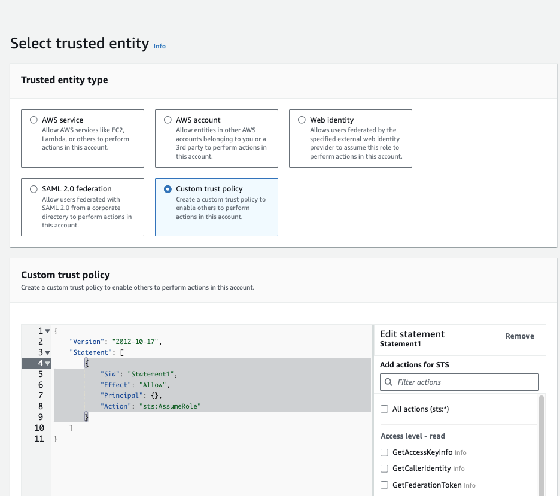



## Introduction

[Terraform](https://www.terraform.io/) is an Infrastucture as Code (IaC) software tool that uses a declarative, human-readable markup language to manage cloud services.
[Github Actions](https://docs.github.com/en/actions/learn-github-actions/understanding-github-actions) is a Continous Integration/Continious Deployment platform that allows you to automate your build, test, and deployment pipeline.

The topic of the day is: **"how can you use Github Actions to create/update/delete your AWS resources using Terraform?"**
Obviously (or not 😛) we need:
- a github project
- a terraform code and
- a Github Actions workflow

One question remains, **how can you give your Github Actions workflow rights to perform operations on AWS?**
If you answer IAM users, I would reply, well yes, it is fast and easy but the [good practice](https://docs.aws.amazon.com/IAM/latest/UserGuide/id.html) in term of security is to provide access to your resources through identity federation.

The idea is to avoid having to store credentials as long-lived GitHub secrets and instead use IAM roles and short-term credentials. The good news is AWS supports [OpenID Connect](https://openid.net/developers/how-connect-works/). With OpenID Connect (OIDC), the Github Actions workflow requests a short-lived access token directly from the cloud provider.
All we need to do is to configure a trust relationship, on the cloud side, that controls which workflows are able to request the access tokens. 

## Configure your AWS

1) [Create an Identity Provider](https://docs.aws.amazon.com/IAM/latest/UserGuide/id_roles_providers_create_oidc.html)
    - At the top of the console, in the search bar, search for and choose: {{ aws.button("IAM", "ternary")}}
    - From the Access Management navigation menu located on the left side of the console, Choose **Identity Providers**
    - Choose {{ aws.button("Add Provider")}}, the **Add an Identity provider** page is displayed
    - Select the radio button **OpenID Connect**
    - In the **Provider URL** field enter: `https://token.actions.githubusercontent.com` and in the **Audience** field enter: `sts.amazonaws.com`

        <i class="icon fa-solid fa-circle-info" style="color:#008296"></i> This info is found in the [Configuring OpenID Connect in Amazon Web Services](https://docs.github.com/en/actions/deployment/security-hardening-your-deployments/configuring-openid-connect-in-amazon-web-services.) of Github documentations.
    - Add tags (optional)
    - Choose {{ aws.button("Add Provider")}}
    - A {{ aws.button("Identity provider added.", "success", "circle-check")}}  message is displayed


2) Create the role that Github Actions will assume
    - At the top of the console, in the search bar, search for and choose: {{ aws.button("IAM", "ternary")}}

    - Choose **Roles**, from the Access Management navigation menu located on the left side of the console
    - Choose {{ aws.button("Create Role")}}
    -  The **Select trusted entity** page is displayed as in the picture below
      {image-display}
    - Select the radio button **Custom trust policy**
    - Another pane is displayed below titled "Custom trust policy"
    - Copy and paste the following JSON
    ```json
    {
      "Version": "2012-10-17",
      "Statement": [
        {
          "Sid": "Statement1",
          "Effect": "Allow",
          "Principal": {
            "Federated": "arn:aws:iam::<accountId>:oidc-provider/token.actions.githubusercontent.com"
          },
          "Action": "sts:AssumeRoleWithWebIdentity",
          "Condition": {
            "StringEquals": {
              "token.actions.githubusercontent.com:aud": "sts.amazonaws.com"
            },
            "StringLike": {
              "token.actions.githubusercontent.com:sub": "repo:<userName>/<repoName>:*"
            }
          }
        }
      ]
    }
    ```
    - Replace `<accountId>`, `<userName>` and `<userName>` with your own values
  
    <i class="icon fa-solid fa-circle-info" style="color:#008296"></i> using a wildcard (*) in the github repository allow requests from any branch. It is recommended to specify a branch.
    - Choose {{ aws.button("Next")}}

    - A page titled **Add permissions** is displayed, select the permissions you will need for your "Github Actions"
    - Choose {{ aws.button("Next")}}
    - Under **Role details**, enter your role name and description. Under Step 1 and Step 2, verify that everything is correct. Under Step 3, you can add Tags
    - Choose {{ aws.button("Create role")}}
    -  A {{ aws.button("Role <yourRoleName> created.", "success", "circle-check")}} message is displayed on top of the screen


## Write the code
Let assume our project has the following folder structure:
```bash
.
├── README.md
├── .github/
│   └── deploy.yml
└── iac
   └── terraform/
       ├── dev/
       │   ├── README.md
       │   ├── providers.tf
       │   └── main.tf
       └── modules/
           └── s3/
               ├── README.md
               ├── main.tf
               ├── providers.tf
               └── variables.tf
```
I use modules to organise my terraform folder. As this article is more on OIDC setup with Github Actions, I will not focus too much on explaining my terraform setup.

### The terraform code

Let's say we want to create an s3 bucket.

On one hand we have the s3 modules with the following files:

```tf{filename=modules/s3/s3.tf}
resource "aws_s3_bucket" "this" {
  bucket        = var.bucket_name
  force_destroy = false
}

resource "aws_s3_bucket_ownership_controls" "this" {
  bucket = aws_s3_bucket.this.id
  rule {
    object_ownership = "BucketOwnerPreferred"
  }
}

resource "aws_s3_bucket_acl" "this" {
  depends_on = [aws_s3_bucket_ownership_controls.this]

  bucket = aws_s3_bucket.this.id
  acl    = "private"
}
resource "aws_s3_bucket_public_access_block" "this" {
  bucket                  = var.bucket_name
  block_public_acls       = true
  block_public_policy     = true
  restrict_public_buckets = true
  ignore_public_acls      = true
}
```
<br/>

```tf{filename=modules/s3/variables.tf}
variable "bucket_name" {
  description = "Name of the s3 bucket. Must be unique."
  type        = string
}
```
<br/>

```tf{filename=modules/s3/providers.tf}
terraform {

  required_version = ">=1.7.0"

  required_providers {
    aws = {
      source  = "hashicorp/aws"
      version = "~> 5.33.0"
    }
  }
}

```
<br/>

On the other hand, we use the above module with the following files:

```tf{filename=dev/main.tf}
module "s3_bucket_dev" {
  source = "../modules/s3"
  bucket_name = "<your-bucket-name-dev>"
}
```
<br/>

```tf{filename=dev/providers.tf}
provider "aws" {
  region = "<yourAWSRegion>"

  default_tags {
    "env"           = "dev"
    "managed_by"    = "terraform"
    "resource_origin" = "<your-github-repo>"
    ... #add as many tags as needed
  }
}
```

### The Github Actions

Let's create our Github Actions for deploying the terraform code

```yaml{filename=deploy.yaml}
# This is a basic workflow to help you get started with Actions
name: deploy terraform on AWS using OIDC
on:
  workflow_dispatch:
  pull_request:
    types: [opened, synchronize, closed]
    branches:
      - main
    paths:
      - "iac/terraform/**"

permissions:
  id-token: write # This is required for aws oidc connection
  contents: read # This is required for actions/checkout
  pull-requests: write # This is required for gh bot to comment PR

jobs:
  deploy:
    steps:
      - name: Git checkout
        uses: actions/checkout@v4
      - name: Configure AWS credentials from AWS account
        uses: aws-actions/configure-aws-credentials@v4
        with:
          role-to-assume: {{ "${{ secrets.AWS_ROLE_ARN }}" }} 
          aws-region:  {{ "${{ secrets.AWS_REGION }}" }} 
          role-session-name: docker-for-github
      # Test that your workflow works by doing:
      - name: Sts GetCallerIdentity
        run: |
          aws sts get-caller-identity
      ... # complete with other steps if needed
  ```
  
  {{ aws.icon("fa-solid fa-circle-info", "#008296")}} Your `AWS_ROLE_ARN` is a the same as the `<yourRoleName>` created in the above section. It is stored in github secrets. `AWS_REGION` is your AWS region. It is stored as a secret as well.

We are done ! We have:
- [x] Created an identity provider
- [x] Created the role that Github Actions will assume to create ressources on AWS
- [x] Wrote a terraform code to create an S3 bucket
- [x] Wrote a Github Actions to deploy our terraform code