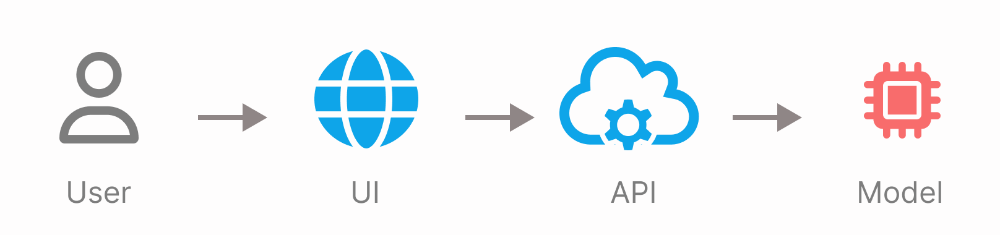
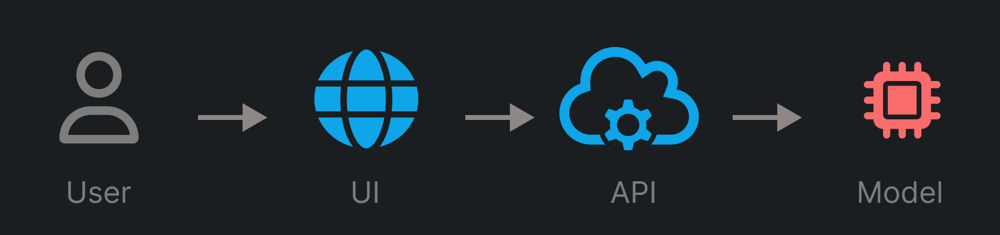
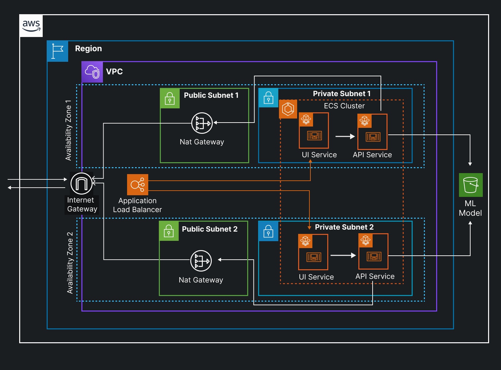
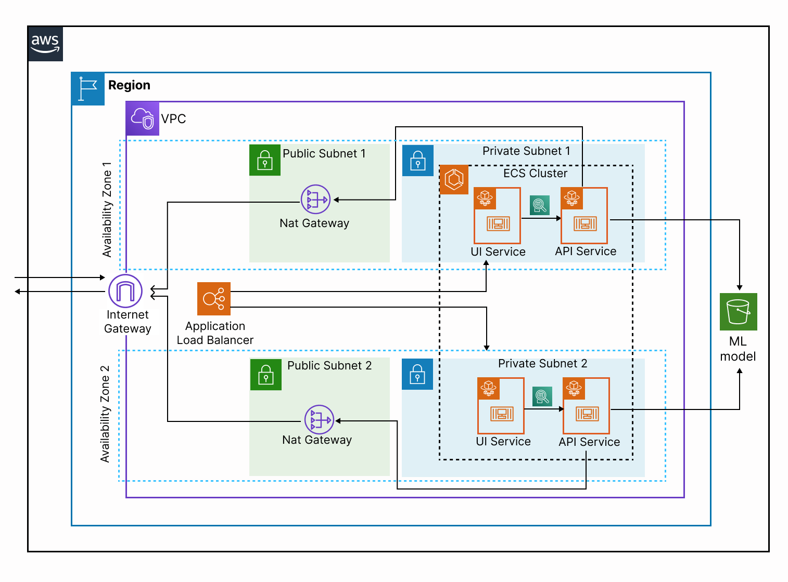



## Introduction
Let's say you've found your model, you've trained it and you are satisfied with the results. Let's decompose our application into two parts: 
- an API is built around the model using [FastAPI](https://fastapi.tiangolo.com/) (or [Flask](https://flask.palletsprojects.com/en/3.0.x/))
- a UI is built using [streamlit](https://streamlit.io/), to interact with our API

You containerized both your API and UI and now you are wondering "how to make it available on the internet?", specifically on AWS.


{image-display color=light-img}
{image-display color=dark-img} 

What are our options with AWS? (this is of course a non-exhaustive list):
- **Elastic Beanstalk**: upload the code you want to run, configure a few deployment settings, and let Amazon complete the process for getting the app running for you,
- **Elastic Container Service (ECS)**: configure deploy, manage, and scale containerized applications with a fully managed container orchestration service,
- **S3** + **API Gateway** + **Lambda**: host your UI on S3 and deplou your API with **API Gateway** and **Lambda**,
- **Elastic Kubernetes Service (EKS)**: deploy everything in a Kubernetes cluster,
- **EC2**: deploy and manage manually yourself in an EC2 instance.

> And the winner is... 🥁 **ECS** 🎉


## Amazon Elastic Container Service (ECS)
I choose ECS for the following reasons:
- It is a native container orchestration tools,
- It has lower barrier to entry than EKS. In addition, EKS seems like a sledgehammer 🔨 to crack a nut 🌰, in this specific case,
- It holds more freedom of configuration compared to beanstalk,
- It feels less hacky than the combinaison of s3 hosting and lambda (although I believe for a simple API deployment, "API Gateway + Lambda" would have been a prime choice),
- It saves you the hassle of managing everything on (the OS layer of) the EC2, after all it is just a VM.


There are three options for running containers with Amazon ECS:
- [ ] ECS/EC2: deploy and manage your own cluster and manage yourself the [EC2](https://aws.amazon.com/ec2/) instances on which everything is running
- [x] ECS/Fargate: use ECS without having to manage EC2 servers or clusters.
- [ ] ECS/On-premises Virtual Machines (VM) or servers: register your own external on-premises server or Virtual Machine (VM), to your Amazon ECS cluster.

> In today's post, we will discuss the architecture for the deployment of the  **UI** and **API** that serve our ML model predictions, using de Amazon ECS Fargate.


## Deployment Architecture
{image-display color=dark-img}

{image-display color=light-img}

### Architecture Description
As a reminder, our application is composed of two parts/services: an API and a UI. And they are both containerized. The model is stored on s3. The architectural diagram above describes our application deployed in a virtual private cloud (VPC) with a multi-AZ (availability zone) setup.

{{ aws.info()}} An Availability Zone (AZ) consists of one or more discrete data centers, with redundant power, networking, and connectivity housed in separate facilities.

A load balancer is responsible for distributing traffic within the AZs. Both services operate within a private subnet and their scaling is managed by Fargate. Fargate eliminates the need to provision and manage servers. In this particular setup, the API needs to communicate with the Internet. And because it sits on a private subnet, we need a NAT (Network Address Translation) gateway. So if none of your services need to send requests to the Internet, you can just remove the public subnets part (with the NAT Gateway) from the architecture.

{{ aws.info()}} Note that when you have a NAT Gateway you are charged for each hour that it is available and each gigabyte of data that it processes. Not having it, saves you money! 💰.


### How to deploy this architecture with Terraform?

You can find the code for deploying this exact infrastructure by clicking here: {{badge.element("Terraform code", "https://github.com/tekeinhor/tag-generator/tree/main/iac")}}  

> **DISCLAIMER**: Although I tried my best to have a production level setup it might have some problems that I’m not aware of. Use it at your own risk.

The structure of the the `iac/terraform` directory is as follow:
```sh
.
├── README.md
├── .github/workflows/
├── ...
└── iac
   └── terraform/
       ├── dev/                                 # I use folder to seperate my deployment environment
       │   ├── README.md
       │   ├── providers.tf
       │   └── main.tf
       └── modules/
           └── ecs/
               ├── main.tf                      # create the ECS cluster and the iam role necessary to execute ECS
               ├── api.tf                       # create the ECS service and task configuration for the API
               ├── ui.tf                        # create the ECS service and task configuration for the UI
               ├── load_balancer.tf             # create the load balancer creation and configuration
               ├── networking.tf                # create the private and public subnets and connect them to internet gateway and NAT gateway
               ├── main.tf
               ├── security.tf                  # create security groups for the UI, the API and the load balancer.
               └── variables.tf                 # define the module variables
```


## Conclusion

We've seen an example of an architecture for deploying an entire project on AWS. Of course, there are many ways this architecture could be improved. So here is a (non-exhaustive) list of areas for improvement:
- Scalability: improve dimensioning of the services with Fargate,
- Observability: add monitoring (of logs, metrics and traces) add alerting in order to better handle failures, crashes and downtime,
- Security: improve security of services within AWS with WAF (Web Application Firewall).
