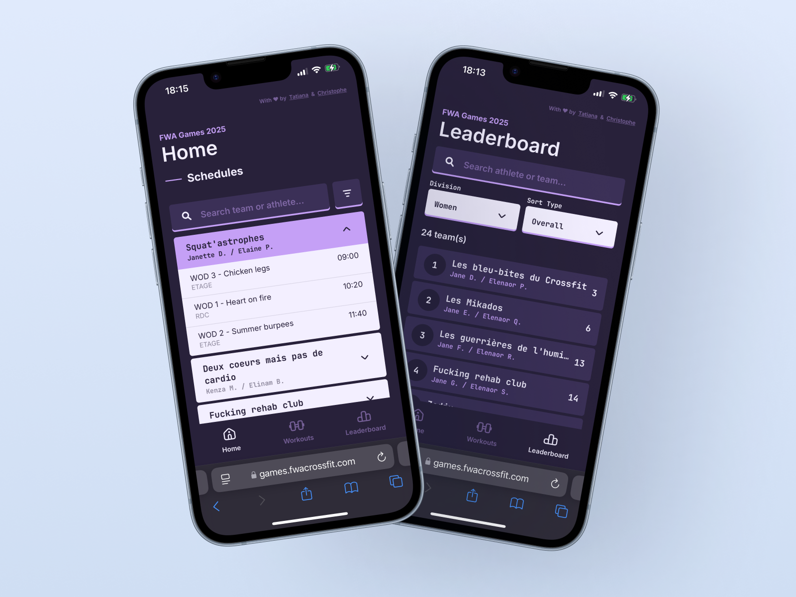
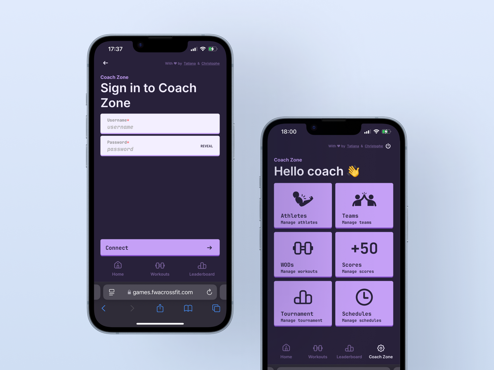
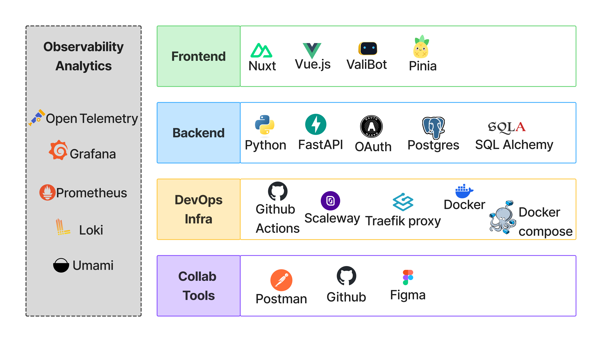
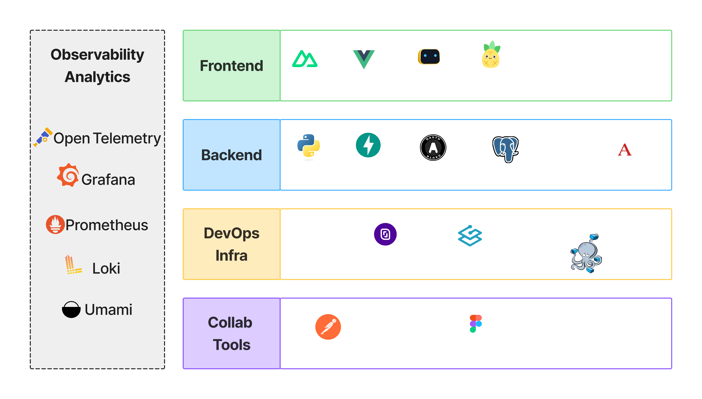

<!-- {image-display color=light-img} -->
{image-display}

Welcome to the 2025 FWA Games! When I found out that my CrossFit gym was planning an internal competition, I had an idea! Why not suggest a leaderboard app/website to the head coach? Well, I did just that and he accepted.

I needed a "frontend" engineer partner and luckily I knew a very brilliant one, [Christophe](https://chrsmsln.com). He agreed to join me on this journey. And we had **two months** to make it happen. Every two weeks we met with the coaches to understand the needs, define a specification, design a prototype and finally deliver a leaderboard webapp for the FWA crossfit games.

## The Features

Teh public has access to three pages:
  - A Home page with general information, competition schedule per team
  - A WOD (Workout of the Day, a crossfit workout) page, with details of the competition workouts
  - A leaderboard page with each team results

In addition to the public access, there was an admin access for the coaches with:
  - A space to create athletes
  - A space to create teams
  - A space to manage schedules
  - A space to manage WOD 
  - A space to input scores

How do you compute the score, how many athletes is there in a team, how many division are there? Is it possible to have mix teams?
These were some of the questions we had for 

{image-display}

## Tech Stack

This was a rather classic CRUD, frontend, backend, database app.

{image-display color=light-img}
{image-display color=dark-img}

### Collaborative Tools

- Github as a code repository
- Github Project for project management
- Figma for the UI design
- Postman

### Frontend Stack
For more info about the frontend please, head over to Christophe's blog!

### Backend Stack
- Tooling
  - uv for project management (env management, python version management)
  - ruff
  - mypy
  - bandit
  - Makefile
  - code coverage with coverage.py
- CICD with Github Action
- API with Python FastAPI
- Authentication with ID and password, Authorization with OAuth and JWT
- Database: Postgresql
- Python DB ORM: Sqlalchemy
- Endpoints testing with Postman

### OPS Stack
- VPS on scaleway
- Reverse proxy with Traefik
- TLS Certficate with let's encrypt
- Continous Deployment with Github Actions
- Containerisation with Docker
- Container Orchestration with Docker compose

### Observability Stack
- OpenTelemetry as the observability framework, with a OTel collector and python SDKs for instrumentation
- Managed Loki (Scaleway Cockpit) as log backend
- Managed Prometheus (Scaleway Cockpit) as a metrics backend
- Managed Grafana (Scaleway Cockpit) for telemetries visualisation

### Analitics Platform
- Umami as an analytics Platform

## What I learned!

- ORM work
- CRUD Database
- ...

## Ideas for improvement
- Anticipate Database schema migration (with Alembic) from the jump start
- Use ansible to automate my VPS management
  - software installation and update
  - user management
  - firewall management
  - backup and recovery automation